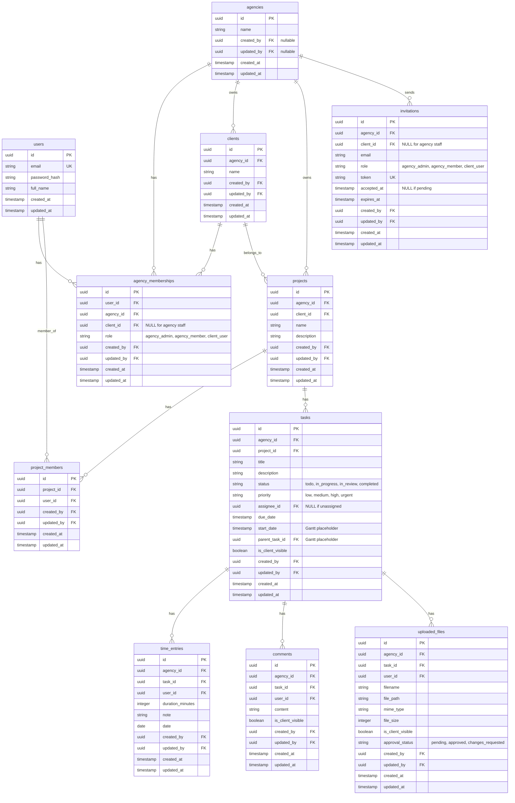

# Implementation Plan - AgencyDesk (Multi-Tenant Agency & Client Portal)

AgencyDesk is a multi-tenant client and project management platform. This plan details the schema, architecture, and edge-case handling mechanisms to ensure robust tenant isolation, secure access control, audit tracking, and high performance.

---

## Architecture Design & Extension Points

We will architect the backend using a modular, decoupled structure. The directory layout will separate concerns (routers, services, and core database components), making it easy to append new modules in the future.

### Extension Points for Future Modules

To prepare for future expansion without cluttering the initial build, we design the following clean extension points:

#### 1. Notifications & Automations (Bonus)
- **Architecture**: Event-driven notification system.
- **Extension Point**: We will implement an `app/services/event_bus.py` which exposes a simple pub-sub mechanism. 
- **Trigger Hooks**: Whenever a task, comment, or file is created or updated, we dispatch a domain event (e.g. `EVENT_TASK_UPDATED`, `EVENT_FILE_APPROVED`).
- **Notification Handlers**: A future `notification_service` can subscribe to these events to send emails, Webhooks, or Slack notifications.

#### 2. Client Intake Forms (Bonus)
- **Architecture**: A module managing public/auth-free form templates that agencies can share.
- **Extension Point**:
  - We define a future table `client_intake_forms` (`id`, `agency_id`, `title`, `fields_schema`, `is_active`).
  - Form submissions generate a new `client` and `project` record automatically using our existing service functions.

#### 3. Gantt / Timeline View (Discuss only)
- **Architecture**: Task dependency mapping and timeline planning.
- **Extension Point**: We add nullable columns to the `tasks` table:
  - `start_date` (Date, nullable)
  - `parent_task_id` (FK to `tasks.id`, nullable)
  - `dependency_task_id` (or a join table `task_dependencies` mapping task blockers).
  - This allows the Gantt interface to query start/due dates and establish parent-child hierarchies or sequential paths directly.

#### 4. Full CRM (Not in scope)
- **Architecture**: Managing leads, pipeline stages, deals, and contracts.
- **Extension Point**:
  - CRM tables like `crm_leads`, `crm_deals`, and `crm_contracts` will reside in a separate namespace/module, referencing `agencies` for multi-tenancy.
  - When a Deal is marked "Won", an event is dispatched to create a `client` and a `project`, and associate the `lead` contacts as `client_user` memberships.

---

## Proposed Database Schema

All primary keys use UUIDs. Standard audit fields (`created_by`, `updated_by`, `created_at`, `updated_at`) are appended to all tables to ensure full traceability.

---

## Database Constraints & Indices

To guarantee data integrity and scale performance to hundreds of thousands of rows, we implement the following constraints and indices:

### Composite Unique Constraints
1. **`agency_memberships`**: `UNIQUE(user_id, agency_id)`
   - *Rationale*: A user cannot have multiple memberships in the same agency.
2. **`project_members`**: `UNIQUE(project_id, user_id)`
   - *Rationale*: A user cannot be added to the same project membership multiple times.
3. **`invitations`**: `UNIQUE(agency_id, email) WHERE accepted_at IS NULL` (Partial unique index)
   - *Rationale*: Prevents duplicate pending invitations to the same email within an agency. Resending will update the existing pending invite rather than creating a duplicate.

### Performance Indices
- **Multi-Tenant Filter Scoping**:
  - Index on `agency_id` on tables: `clients`, `agency_memberships`, `projects`, `tasks`, `time_entries`, `comments`, `uploaded_files`, `invitations`.
  - *Rationale*: All multi-tenant routing filters by `agency_id`. Indexing guarantees sub-millisecond retrieval.
- **Relational Joins & Foreign Keys**:
  - Index on `project_id` on `project_members`, `tasks`.
  - Index on `client_id` on `projects`.
  - Index on `assignee_id` on `tasks` (for quick retrieval of my-assigned-tasks).
  - Index on `task_id` on `time_entries`, `comments`, `uploaded_files`.
- **Compound Visibility & Query Filters**:
  - Index on `(task_id, is_client_visible)` on tables `comments`, `uploaded_files` (speeds up client loading).
  - Index on `(user_id, agency_id)` on `agency_memberships` (speeds up session authentication validation).
  - Index on `(project_id, is_client_visible)` or `(agency_id, status)` on `tasks` (speeds up Kanban boards and reporting).

---

## Edge Cases Explicitly Handled

### 1. Cross-Tenant Access
- **Constraint**: Tenant A cannot access Tenant B's data, even with UUID guessing.
- **Implementation**:
  - Every tenant-scoped request must supply the active agency context via the `X-Agency-ID` header.
  - A FastAPI security dependency (`get_current_membership`) verifies that the authenticated user possesses an active membership in the requested `agency_id`.
  - CRUD operations strictly enforce the `agency_id` filter.
    `SELECT * FROM tasks WHERE id = :task_id AND agency_id = :verified_agency_id`
    If a user queries another agency's UUID, the query yields empty results, returning a `404 Not Found` (mitigating ID harvesting probes).

### 2. Internal Content Leaking to Clients
- **Constraint**: Client users must never view internal tasks, comments, files, or detailed logs.
- **Implementation**:
  - When the active role in `get_current_membership` is `client_user`:
    - Automatically append: `is_client_visible == True` to all Task, Comment, and File queries.
    - Projects are filtered by `client_id == membership.client_id`.
    - Dashboard metrics: Time entry hours are grouped and summed at the project level. Detailed granular logs (`time_entries` table rows) are restricted to agency staff and are never returned to clients.
  - This validation occurs in backend query builders, not frontend views.

### 3. One Person, Two Agencies
- **Constraint**: One email belongs to multiple agencies with different roles.
- **Implementation**:
  - Global `users` table records credentials.
  - `agency_memberships` manages the user's role per agency.
  - In the frontend, the user is presented with an Agency Switcher workspace layout. Selecting a workspace changes the `X-Agency-ID` header, and the backend dynamically loads the corresponding role policies.

### 4. Invite Races
- **Constraint**: Multiple invites to the same email cannot duplicate pending entries. Accepting twice must fail safely.
- **Implementation**:
  - **Invite Creation**: Uses an upsert mechanism matching the partial unique index:
    - If a pending invitation for `(agency_id, email)` already exists, the backend updates the token, expiration, and role rather than inserting a duplicate.
  - **Invite Acceptance**: Wrapped in a serializable transaction block.
    - `SELECT * FROM invitations WHERE token = :token FOR UPDATE`
    - Checks `accepted_at IS NULL` and `expires_at > NOW()`. If failed, returns `400 Bad Request`.
    - Updates `accepted_at = NOW()`.
    - Creates `users` record if new, then adds the `agency_memberships` link.
    - Subsequent calls fail because `accepted_at` is no longer null.

### 5. Removing a Team Member Mid-Task
- **Constraint**: Handling assignments of removed agency members.
- **Implementation**:
  - When removing an agency member:
    - Transaction deletes the `agency_memberships` row.
    - Updates `tasks` in that agency: `UPDATE tasks SET assignee_id = NULL WHERE assignee_id = :removed_user_id AND agency_id = :agency_id`.
    - Deletes them from `project_members` for all projects in that agency.
  - When removing from a specific project:
    - Deletes from `project_members`.
    - Updates tasks: `UPDATE tasks SET assignee_id = NULL WHERE assignee_id = :removed_user_id AND project_id = :project_id`.

---

## Technical Stack & Running Locally

- **Backend**: FastAPI (Python 3.10+) + SQLAlchemy 2.0 + Alembic migrations.
- **Database**: SQLite (default configuration, zero dependencies) and PostgreSQL (Docker Compose setup included for interview standard).
- **Frontend**: Next.js 14 (TypeScript) + Vanilla CSS / CSS Modules for custom, premium visual layout, and Tailwind CSS for utility grids.

---

## Proposed Changes & File Layout

### Backend Component
We will build the entire backend under a `backend/` directory.

#### [NEW] [backend/requirements.txt](file:///Users/apple/sapyon/backend/requirements.txt)
Python package dependencies.

#### [NEW] [backend/app/main.py](file:///Users/apple/sapyon/backend/app/main.py)
FastAPI application setup, router mounting, and middleware.

#### [NEW] [backend/app/database.py](file:///Users/apple/sapyon/backend/app/database.py)
Database engine creation, session scope helpers, and audit field hooks.

#### [NEW] [backend/app/models.py](file:///Users/apple/sapyon/backend/app/models.py)
SQLAlchemy declarative models with appropriate indexes, composite constraints, and relationship declarations.

#### [NEW] [backend/app/schemas.py](file:///Users/apple/sapyon/backend/app/schemas.py)
Pydantic validation schemas.

#### [NEW] [backend/app/auth.py](file:///Users/apple/sapyon/backend/app/auth.py)
JWT token logic and FastAPI security dependencies.

#### [NEW] [backend/app/routers/...](file:///Users/apple/sapyon/backend/app/routers/auth.py)
Modular API routers.

#### [NEW] [backend/seed.py](file:///Users/apple/sapyon/backend/seed.py)
Database seeder to construct two agencies, project members, tasks, and files.

#### [NEW] [backend/tests/test_api.py](file:///Users/apple/sapyon/backend/tests/test_api.py)
Automated Python test suite using `pytest` verifying tenant isolation, invite races, visibility leaks, audit logging, index performance validation, and member removals.

---

### Frontend Component
Next.js React frontend under a `frontend/` directory.

#### [NEW] [frontend/package.json](file:///Users/apple/sapyon/frontend/package.json)
Frontend Node dependencies.

#### [NEW] [frontend/app/layout.tsx](file:///Users/apple/sapyon/frontend/app/layout.tsx)
Main root layout, CSS variables, context providers.

#### [NEW] [frontend/app/page.tsx](file:///Users/apple/sapyon/frontend/app/page.tsx)
Login/Signup interface.

#### [NEW] [frontend/app/dashboard/...](file:///Users/apple/sapyon/frontend/app/dashboard/page.tsx)
Kanban boards, reporting, client portal, time logs, and file approvals.

---

## Verification Plan

### Automated Tests
We will build a full integration suite in `backend/tests/test_api.py` that verifies:
1. **Tenant Isolation**: Log in as User A from Tenant 1 and attempt to request a project ID from Tenant 2. Confirm it throws `403` or `404`.
2. **Client-Visibility Leakage**: Log in as a `client_user` and verify that queries to projects, tasks, comments, files, and dashboards exclude all items marked `is_client_visible = False`.
3. **Invite Races**: Run concurrent mock requests to accept an invite token and ensure only one succeeds while the other fails with a clean transactional error.
4. **Member Removal**: Remove a user from a project and confirm their tasks are unassigned (`assignee_id == None`).
5. **Audit Trail**: Assert that records created or modified have their `created_by`, `updated_by`, `created_at`, and `updated_at` properties set correctly.
6. **Constraint Assertions**: Verify that attempting to insert duplicate memberships or project members raises integrity violations.

Run command:
`cd backend && pytest -v tests/test_api.py`

### Manual Verification
- We will seed the database with rich test data.
- Run the backend (`uvicorn app.main:app --reload`) and the frontend (`npm run dev`).
- Open the application in the browser and step through logging in as different roles:
  1. `agency_admin` (sees full board, can toggle `is_client_visible` on tasks/comments/files, can view all time entries and dashboards, can invite users).
  2. `agency_member` (sees only assigned projects, can add comments/files, can log time).
  3. `client_user` (sees only their own project board, only client-visible tasks, comments, files, and simple time summary; can approve/reject files, can comment, cannot create tasks).
- Test switching agencies for a user mapped to multiple agencies to confirm the navigation and role permissions update instantaneously.
